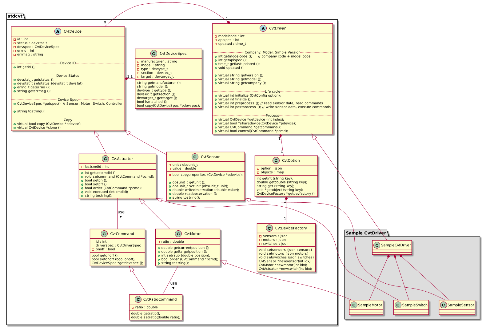

# 드라이버 API

드라이버는 크게 2종류로 구분된다. 센서노드, 제어노드, 컨트롤러와 직접 연결되는 장비측(Device Side)드라이버와 데이터 수집기와 연결되는 서버측(Servier Side)드라이버로 구성된다. 각 드라이버를 DSDriver, SSDriver 라고 한다.

드라이버 API는 기초연동용과 고급연동용으로 구분될 계획이다. 현 단계에서 드라이버는 현상황을 충실히 포함하는쪽으로 설계하는 것을 목표로 하고 있다. 추후에 활성화가 되어 추상화 레벨을 높여서 더 많은 범위를 커버할 수 있기를 바란다.

## 드라이버 API 스펙 문서
현 시점에서 기초 연동을 위한 API 초안이 개발되어 있으며, 참여사와의 워크샵을 통해 기초 연동용 최종안이 개발될 것으로 기대된다.

  1. [기초 연동 API 초안](https://ebio-snu.github.io/cvtdriver/)
  1. [개발자 워크샵 수정안]()
  1. [기초 연동 API 최종안]() : API 버전 1.00
  1. [고급 연동 API 초안]()
  1. [고급 연동 API 최종안]() : API 버전 2.00

## 드라이버 클래스

드라이버는 CvtDriver 클래스를 상속받아 구현한다.
드라이버 클래스 다이어그램은 다음과 같다.

## 드라이버가 가진 장비 데이터의 공유
2개 이상의 DSDriver를 사용하는 경우 개별 DSDriver는 서로 다른 장비를 관리해야한다. 하나의 DSDriver에서 관리되는 장비에 대한 정보는 다른 장비로 전달될 수 있다. 

드라이버로부터 장비 정보를 획득하기 위해서는 CvtDevice *getdevice(int index); 메소드를 활용한다. index는 0부터 시작하고, 값을 하나씩 올려가면서 장비를 꺼낼 수 있다. 이때 리턴값이 nullptr(NULL)인 경우 관리하는 장비가 더이상 없다는 의미이다.

장비의 정보를 다른 드라이버로 전달하기 위해서 bool sharedevice(CvtDevice *pdevice); 메소드를 활용한다.

## 다른 드라이버로 제어명령 전달
장비에 대한 명령도 다른 드라이버로 전달될 수 있다. 다만 초기버전에서는 SSDriver가 하나만 존재하고, SSDriver에서만 명령을 전달할 수 있는 것으로한다.

하나의 드라이버(SSDriver)가 전달하고자 하는 명령은 CvtCommand *getcommand(int index); 메소드를 이용해 얻을 수 있다. index는 0부터 시작하고, 값을 하나씩 올려가면서 명령을 꺼낼 수 있다. 이때 리턴값이 nullptr(NULL)인 경우 더이상의 명령이 없다는 의미이다.

획득한 명령을 다른 드라이버로 전달하기 위해서 bool control(CvtCommand *pcmd); 메소드를 활용한다.

